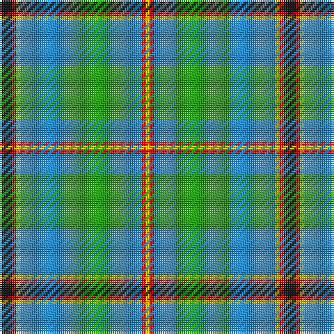

The parent of this is [Snodgrass (Clan)](/tartans/k/6/r2/y2/b22/g26/b10/r2/y/2/)

This was sourced from tartans-authority.  It is a [8 stripes tartan](/stripes/stripes8/).

Original link http://www.tartansauthority.com/tartan-ferret/display/1216/

## Thread count
K/6 R2 Y2 B22 G26 B10 R2 Y/2

## Palette
Each colour and its ΔE from the base-6 reference it is a variant of.

| Colour | Shade | Base | ΔE (OKLab) |
|---|---|---|---|
| B |  `#2888C4` | B  | 0.21 |
| G |  `#289C18` | G  | 0.18 |
| K |  `#101010` | K  | 0.17 |
| R |  `#C80000` | R  | 0.00 |
| Y |  `#E8C000` | Y  | 0.00 |

# Sample pattern

ID: /variants/k/6/r2/y2/b22/g26/b10/r2/y/2-b2888c4-g289c18-k101010-rc80000-ye8c000/
