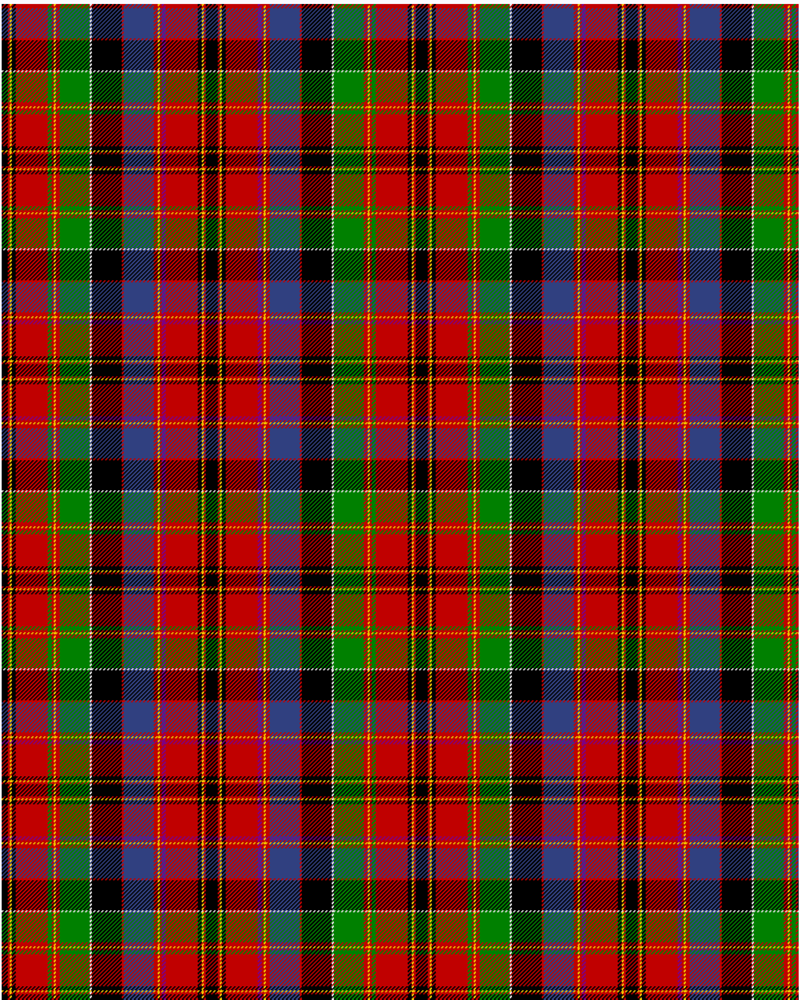

Hay, or Leith

This was sourced from <no value>.  It is a 23 stripes tartan.

Original link http://www.weddslist.com/cgi-bin/tartans/pg.pl?source=sts

## Thread count
K/6 R2 Y2 K4 R32 G4 R2 Y2 R4 G30 LN2 K30 R2 B30 R4 Y2 R2 P4 R32 K4 Y2 R2 K/6

## Palette
B#304080 G#008000 K#000000 LN#E0E0E0 P#800080 R#C00000 Y#F0C000

# Sample pattern

ID: /variants/k/6/r2/y2/k4/r32/g4/r2/y2/r4/g30/ln2/k30/r2/b30/r4/y2/r2/p4/r32/k4/y2/r2/k/6-b304080-g008000-k000000-lne0e0e0-p800080-rc00000-yf0c000