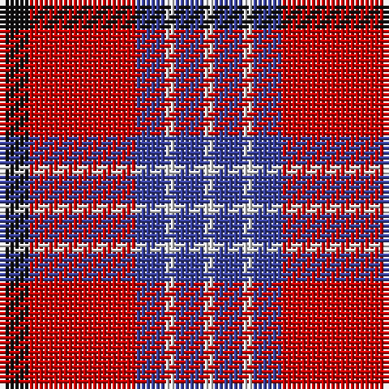

The parent of this is [Suntan (Masai Shuka) (District?)](/tartans/k/6/r22/b6/ln2/b6/ln/2/)

This was sourced from tartans-authority.  It is a [6 stripes tartan](/stripes/stripes6/).

Original link http://www.tartansauthority.com/tartan-ferret/display/8003/

## Thread count
K/6 R22 B6 LN2 B6 LN/2

## Palette
Each colour and its ΔE from the base-6 reference it is a variant of.

| Colour | Shade | Base | ΔE (OKLab) |
|---|---|---|---|
| B |  `#38409C` | B  | 0.04 |
| K |  `#101010` | K  | 0.17 |
| LN |  `#E0E0E0` | W  | 0.06 |
| R |  `#C80000` | R  | 0.00 |

# Sample pattern

ID: /variants/k/6/r22/b6/ln2/b6/ln/2-b38409c-k101010-lne0e0e0-rc80000/
