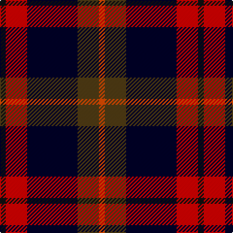

The parent of this is [Novotel, The](/tartans/k/6/r22/db52/t22/ra/6/)

This was sourced from register-of-tartans.  It is a [5 stripes tartan](/stripes/stripes5/).

Original link https://www.tartanregister.gov.uk/tartanDetails.aspx?ref=3205

## Thread count
K/6 R22 DB52 T22 Ra/6

## Palette
Each colour and its ΔE from the base-6 reference it is a variant of.

| Colour | Shade | Base | ΔE (OKLab) |
|---|---|---|---|
| DB |  `#000028` | K  | 0.15 |
| K |  `#101010` | K  | 0.17 |
| R |  `#DC0000` | R  | 0.04 |
| Ra |  `#FA4B00` | R  | 0.14 |
| T |  `#503C14` | G  | 0.15 |

# Sample pattern

ID: /variants/k/6/r22/db52/t22/ra/6-db000028-k101010-rdc0000-rafa4b00-t503c14/
