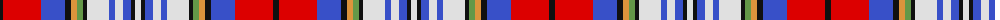

The parent of this is [Badminton World Federation](/tartans/k/6/r38/b24/k6/o6/lg6/k4/ln22/b6/ln8/b8/k4/ln/6/)

This was sourced from register-of-tartans.  It is a [13 stripes tartan](/stripes/stripes13/).

Original link https://www.tartanregister.gov.uk/tartanDetails.aspx?ref=11145

## Thread count
K/6 R38 B24 K6 O6 LG6 K4 LN22 B6 LN8 B8 K4 LN/6

## Palette
Each colour and its ΔE from the base-6 reference it is a variant of.

| Colour | Shade | Base | ΔE (OKLab) |
|---|---|---|---|
| B |  `#3850C8` | B  | 0.12 |
| K |  `#101010` | K  | 0.17 |
| LG |  `#649848` | G  | 0.19 |
| LN |  `#E0E0E0` | W  | 0.06 |
| O |  `#DC943C` | Y  | 0.12 |
| R |  `#DC0000` | R  | 0.04 |

ID: /variants/k/6/r38/b24/k6/o6/lg6/k4/ln22/b6/ln8/b8/k4/ln/6-b3850c8-k101010-lg649848-lne0e0e0-odc943c-rdc0000/
