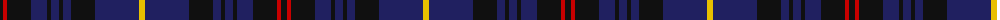

The parent of this is [Caledonian Dragon (Corporate)](/tartans/k/6/r4/k24/db16/k4/db8/k4/db8/k24/db44/y/6/)

This was sourced from tartans-authority.  It is a [11 stripes tartan](/stripes/stripes11/).

Original link http://www.tartansauthority.com/tartan-ferret/display/5783/

## Thread count
K/6 R4 K24 DB16 K4 DB8 K4 DB8 K24 DB44 Y/6

## Palette
Each colour and its ΔE from the base-6 reference it is a variant of.

| Colour | Shade | Base | ΔE (OKLab) |
|---|---|---|---|
| DB |  `#202060` | B  | 0.11 |
| K |  `#101010` | K  | 0.17 |
| R |  `#C80000` | R  | 0.00 |
| Y |  `#E8C000` | Y  | 0.00 |

ID: /variants/k/6/r4/k24/db16/k4/db8/k4/db8/k24/db44/y/6-db202060-k101010-rc80000-ye8c000/
