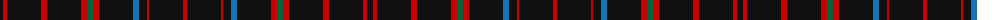

The parent of this is [Hebrides #11](/tartans/k/6/r4/k34/r6/k34/r6/g6/r6/k34/b6/k8/r2/k34/r/4/)

This was sourced from register-of-tartans.  It is a [14 stripes tartan](/stripes/stripes14/).

Original link https://www.tartanregister.gov.uk/tartanDetails.aspx?ref=1667

## Thread count
K/6 R4 K34 R6 K34 R6 G6 R6 K34 B6 K8 R2 K34 R/4

## Palette
Each colour and its ΔE from the base-6 reference it is a variant of.

| Colour | Shade | Base | ΔE (OKLab) |
|---|---|---|---|
| B |  `#1474B4` | B  | 0.15 |
| G |  `#00643C` | G  | 0.06 |
| K |  `#101010` | K  | 0.17 |
| R |  `#C80000` | R  | 0.00 |

ID: /variants/k/6/r4/k34/r6/k34/r6/g6/r6/k34/b6/k8/r2/k34/r/4-b1474b4-g00643c-k101010-rc80000/
