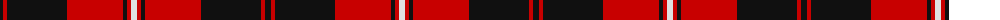

The parent of this is [Cunningham (Clan)](/tartans/k/6/r4/k60/r56/k4/r4/ln/6/)

This was sourced from tartans-authority.  It is a [7 stripes tartan](/stripes/stripes7/).

Original link http://www.tartansauthority.com/tartan-ferret/display/4644/

## Thread count
K/6 R4 K60 R56 K4 R4 LN/6

## Palette
Each colour and its ΔE from the base-6 reference it is a variant of.

| Colour | Shade | Base | ΔE (OKLab) |
|---|---|---|---|
| K |  `#101010` | K  | 0.17 |
| LN |  `#E0E0E0` | W  | 0.06 |
| R |  `#C80000` | R  | 0.00 |

# Sample pattern

ID: /variants/k/6/r4/k60/r56/k4/r4/ln/6-k101010-lne0e0e0-rc80000/
