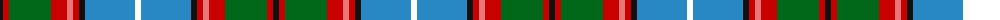

The parent of this is [Dunedin (USA)](/tartans/k/6/r6/g42/r16/lr6/r6/k6/b50/w/6/)

This was sourced from register-of-tartans.  It is a [9 stripes tartan](/stripes/stripes9/).

Original link https://www.tartanregister.gov.uk/tartanDetails.aspx?ref=1042

## Thread count
K/6 R6 G42 R16 LR6 R6 K6 B50 W/6

## Palette
Each colour and its ΔE from the base-6 reference it is a variant of.

| Colour | Shade | Base | ΔE (OKLab) |
|---|---|---|---|
| B |  `#2888C4` | B  | 0.21 |
| G |  `#006818` | G  | 0.02 |
| K |  `#101010` | K  | 0.17 |
| LR |  `#E87878` | R  | 0.19 |
| R |  `#C80000` | R  | 0.00 |
| W |  `#FCFCFC` | W  | 0.03 |

ID: /variants/k/6/r6/g42/r16/lr6/r6/k6/b50/w/6-b2888c4-g006818-k101010-lre87878-rc80000-wfcfcfc/
