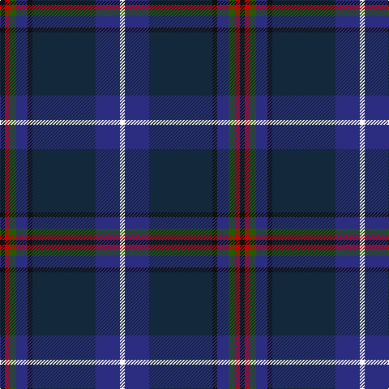

The parent of this is [American National (Fashion)](/tartans/k/6/r6/g8/db14/k6/dn78/db30/w/6/)

This was sourced from tartans-authority.  It is a [8 stripes tartan](/stripes/stripes8/).

Original link http://www.tartansauthority.com/tartan-ferret/display/6882/

## Thread count
K/6 R6 G8 DB14 K6 DN78 DB30 W/6

## Palette
Each colour and its ΔE from the base-6 reference it is a variant of.

| Colour | Shade | Base | ΔE (OKLab) |
|---|---|---|---|
| DB |  `#2C2C80` | B  | 0.05 |
| DN |  `#14283C` | B  | 0.14 |
| G |  `#285800` | G  | 0.04 |
| K |  `#101010` | K  | 0.17 |
| R |  `#C80000` | R  | 0.00 |
| W |  `#F8F8F8` | W  | 0.01 |

# Sample pattern

ID: /variants/k/6/r6/g8/db14/k6/dn78/db30/w/6-db2c2c80-dn14283c-g285800-k101010-rc80000-wf8f8f8/
