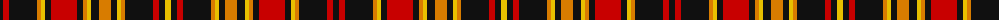

The parent of this is [Stevens #6](/tartans/k/6/r6/k28/o4/y4/k6/r26/k6/o4/y4/k8/o12/k6/y4/o4/k28/r6/k6/y/6/)

This was sourced from register-of-tartans.  It is a [19 stripes tartan](/stripes/stripes19/).

Original link https://www.tartanregister.gov.uk/tartanDetails.aspx?ref=3925

## Thread count
K/6 R6 K28 O4 Y4 K6 R26 K6 O4 Y4 K8 O12 K6 Y4 O4 K28 R6 K6 Y/6

## Palette
Each colour and its ΔE from the base-6 reference it is a variant of.

| Colour | Shade | Base | ΔE (OKLab) |
|---|---|---|---|
| K |  `#101010` | K  | 0.17 |
| O |  `#D87C00` | Y  | 0.17 |
| R |  `#C80000` | R  | 0.00 |
| Y |  `#E8C000` | Y  | 0.00 |

ID: /variants/k/6/r6/k28/o4/y4/k6/r26/k6/o4/y4/k8/o12/k6/y4/o4/k28/r6/k6/y/6-k101010-od87c00-rc80000-ye8c000/
