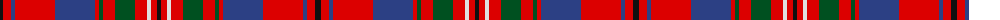

The parent of this is [Cameron of Locheil (Bonner collection)](/tartans/k/6/r8/b4/r40/b40/r4/g4/r12/g20/r12/ln4/r6/k/4/)

This was sourced from register-of-tartans.  It is a [13 stripes tartan](/stripes/stripes13/).

Original link https://www.tartanregister.gov.uk/tartanDetails.aspx?ref=500

## Thread count
K/6 R8 B4 R40 B40 R4 G4 R12 G20 R12 LN4 R6 K/4

## Palette
Each colour and its ΔE from the base-6 reference it is a variant of.

| Colour | Shade | Base | ΔE (OKLab) |
|---|---|---|---|
| B |  `#2C4084` | B  | 0.00 |
| G |  `#005020` | G  | 0.08 |
| K |  `#101010` | K  | 0.17 |
| LN |  `#E0E0E0` | W  | 0.06 |
| R |  `#DC0000` | R  | 0.04 |

ID: /variants/k/6/r8/b4/r40/b40/r4/g4/r12/g20/r12/ln4/r6/k/4-b2c4084-g005020-k101010-lne0e0e0-rdc0000/
