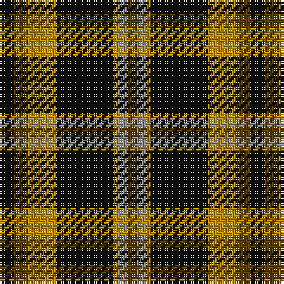

The parent of this is [Strummer, Joe (Commemorative)](/tartans/k/6/t6/dy12/k24/dy2/n4/t/4/)

This was sourced from tartans-authority.  It is a [7 stripes tartan](/stripes/stripes7/).

Original link http://www.tartansauthority.com/tartan-ferret/display/10750/

## Thread count
K/6 T6 DY12 K24 DY2 N4 T/4

## Palette
Each colour and its ΔE from the base-6 reference it is a variant of.

| Colour | Shade | Base | ΔE (OKLab) |
|---|---|---|---|
| DY |  `#BC8C00` | Y  | 0.16 |
| K |  `#101010` | K  | 0.17 |
| N |  `#888888` | R  | 0.24 |
| T |  `#604000` | G  | 0.14 |

# Sample pattern

ID: /variants/k/6/t6/dy12/k24/dy2/n4/t/4-dybc8c00-k101010-n888888-t604000/
