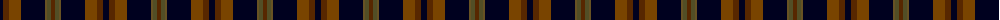
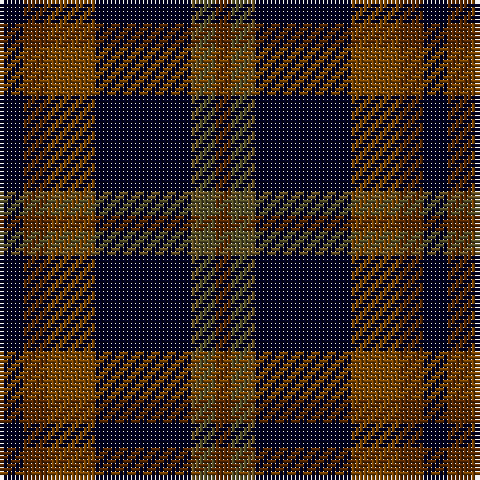

The parent of this is [Joe Strummer Commemorative](/tartans/k/6/t6/ta12/k24/g2/ga4/t/4/)

This was sourced from register-of-tartans.  It is a [7 stripes tartan](/stripes/stripes7/).

Original link https://www.tartanregister.gov.uk/tartanDetails.aspx?ref=10750

## Thread count
K/6 T6 Ta12 K24 G2 Ga4 T/4

## Palette
Each colour and its ΔE from the base-6 reference it is a variant of.

| Colour | Shade | Base | ΔE (OKLab) |
|---|---|---|---|
| G |  `#675223` | G  | 0.13 |
| Ga |  `#524E26` | G  | 0.11 |
| K |  `#00011F` | K  | 0.13 |
| T |  `#572700` | G  | 0.20 |
| Ta |  `#794400` | R  | 0.16 |

# Sample pattern

ID: /variants/k/6/t6/ta12/k24/g2/ga4/t/4-g675223-ga524e26-k00011f-t572700-ta794400/
