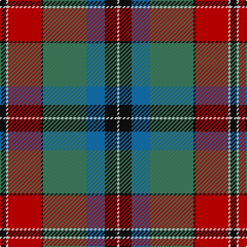

The parent of this is [Ford & Etal (Corporate)](/tartans/k/6/w2/r32/k2/g42/b18/k12/w/2/)

This was sourced from tartans-authority.  It is a [8 stripes tartan](/stripes/stripes8/).

Original link http://www.tartansauthority.com/tartan-ferret/display/6193/

## Thread count
K/6 W2 R32 K2 G42 B18 K12 W/2

## Palette
Each colour and its ΔE from the base-6 reference it is a variant of.

| Colour | Shade | Base | ΔE (OKLab) |
|---|---|---|---|
| B |  `#1474B4` | B  | 0.15 |
| G |  `#408060` | G  | 0.13 |
| K |  `#101010` | K  | 0.17 |
| R |  `#C80000` | R  | 0.00 |
| W |  `#FCFCFC` | W  | 0.03 |

# Sample pattern

ID: /variants/k/6/w2/r32/k2/g42/b18/k12/w/2-b1474b4-g408060-k101010-rc80000-wfcfcfc/
