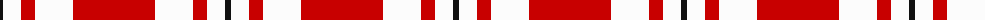

The parent of this is [MacGregor - 2005 (Black - Personal)](/tartans/k/6/w2/w16/r14/w38/r/82/)

This was sourced from tartans-authority.  It is a [6 stripes tartan](/stripes/stripes6/).

Original link http://www.tartansauthority.com/tartan-ferret/display/6988/

## Thread count
K/6 W2 W16 R14 W38 R/82

## Palette
Each colour and its ΔE from the base-6 reference it is a variant of.

| Colour | Shade | Base | ΔE (OKLab) |
|---|---|---|---|
| K |  `#101010` | K  | 0.17 |
| R |  `#C80000` | R  | 0.00 |
| W |  `#FCFCFC` | W  | 0.03 |

# Sample pattern

ID: /variants/k/6/w2/w16/r14/w38/r/82-k101010-rc80000-wfcfcfc/
