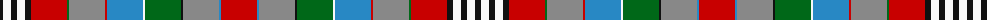

The parent of this is [Edinburgh, City of.. (2001) District Tartan Tartan Number: 6396. Earliest known date: June 2001 Asymmetric tartan. Lochcarron swatch. Note says June 2001 Trial. Muted version woven in 1999. See products available Copyright © Blair Urquhart, Comrie, 2015](/tartans/k/6/w8/k6/w8/k6/r36/g2/n36/r2/b36/w2/g36/k2/n36/b2/r/36/)

This was sourced from house-of-tartan.  It is a [16 stripes tartan](/stripes/stripes16/).

Original link http://www.house-of-tartan.scotland.net/house/TartanViewjs.asp?colr=Def&tnam=6396

## Thread count
K/6 W8 K6 W8 K6 R36 G2 N36 R2 B36 W2 G36 K2 N36 B2 R/36

## Palette
Each colour and its ΔE from the base-6 reference it is a variant of.

| Colour | Shade | Base | ΔE (OKLab) |
|---|---|---|---|
| B |  `#2888C4` | B  | 0.21 |
| G |  `#006818` | G  | 0.02 |
| K |  `#101010` | K  | 0.17 |
| N |  `#888888` | R  | 0.24 |
| R |  `#C80000` | R  | 0.00 |
| W |  `#F8F8F8` | W  | 0.01 |

ID: /variants/k/6/w8/k6/w8/k6/r36/g2/n36/r2/b36/w2/g36/k2/n36/b2/r/36-b2888c4-g006818-k101010-n888888-rc80000-wf8f8f8/
