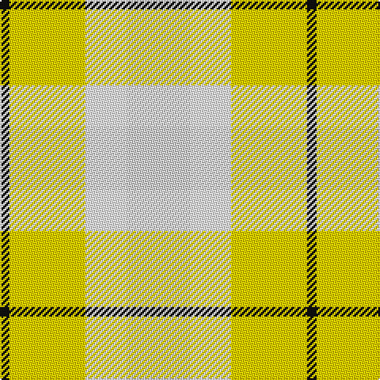

The parent of this is [Spirit of Riverside](/tartans/k/6/y48/w26/n/40/)

This was sourced from register-of-tartans.  It is a [4 stripes tartan](/stripes/stripes4/).

Original link https://www.tartanregister.gov.uk/tartanDetails.aspx?ref=5818

## Thread count
K/6 Y48 W26 N/40

## Palette
Each colour and its ΔE from the base-6 reference it is a variant of.

| Colour | Shade | Base | ΔE (OKLab) |
|---|---|---|---|
| B |  `#0000FF` | B  | 0.21 |
| G |  `#008000` | G  | 0.09 |
| K |  `#101010` | K  | 0.17 |
| N |  `#D3D3D3` | W  | 0.10 |
| W |  `#FFFFFF` | W  | 0.03 |
| Y |  `#FFD700` | Y  | 0.07 |

# Sample pattern

ID: /variants/k/6/y48/w26/n/40-b0000ff-g008000-k101010-nd3d3d3-wffffff-yffd700/
