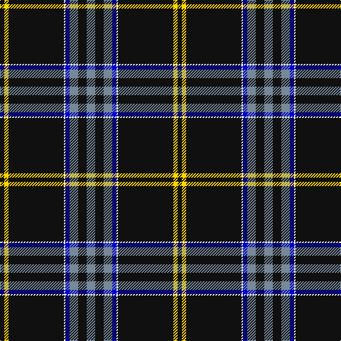

The parent of this is [Washington County Sheriff’s Office (Oregon)](/tartans/k/6/y6/k78/w2/b6/n12/k12/n/12/)

This was sourced from register-of-tartans.  It is a [8 stripes tartan](/stripes/stripes8/).

Original link https://www.tartanregister.gov.uk/tartanDetails.aspx?ref=10361

## Thread count
K/6 Y6 K78 W2 B6 N12 K12 N/12

## Palette
Each colour and its ΔE from the base-6 reference it is a variant of.

| Colour | Shade | Base | ΔE (OKLab) |
|---|---|---|---|
| B |  `#0000CD` | B  | 0.15 |
| K |  `#101010` | K  | 0.17 |
| N |  `#778899` | B  | 0.24 |
| W |  `#FFFFFF` | W  | 0.03 |
| Y |  `#FFD700` | Y  | 0.07 |

# Sample pattern

ID: /variants/k/6/y6/k78/w2/b6/n12/k12/n/12-b0000cd-k101010-n778899-wffffff-yffd700/
