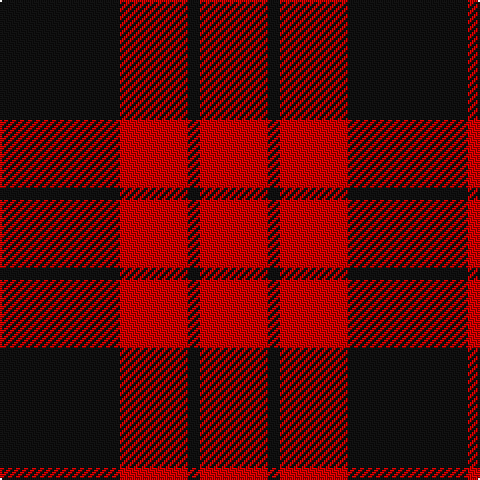

The parent of this is [MacFarlane Red & Black (Artefact)](/tartans/k/60/r34/k6/r/34/)

This was sourced from tartans-authority.  It is a [4 stripes tartan](/stripes/stripes4/).

Original link http://www.tartansauthority.com/tartan-ferret/display/8936/

## Thread count
K/60 R34 K6 R/34

## Palette
Each colour and its ΔE from the base-6 reference it is a variant of.

| Colour | Shade | Base | ΔE (OKLab) |
|---|---|---|---|
| K |  `#101010` | K  | 0.17 |
| R |  `#C80000` | R  | 0.00 |

# Sample pattern

ID: /variants/k/60/r34/k6/r/34-k101010-rc80000/
