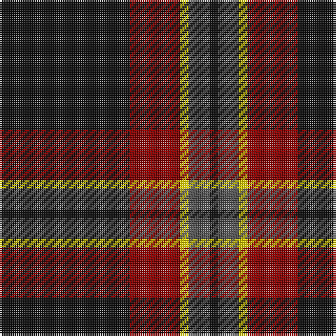

The parent of this is [Perry (2014)](/tartans/k/62/dr24/y4/n10/k/4/)

This was sourced from register-of-tartans.  It is a [5 stripes tartan](/stripes/stripes5/).

Original link https://www.tartanregister.gov.uk/tartanDetails.aspx?ref=11023

## Thread count
K/62 DR24 Y4 N10 K/4

## Palette
Each colour and its ΔE from the base-6 reference it is a variant of.

| Colour | Shade | Base | ΔE (OKLab) |
|---|---|---|---|
| DR |  `#880000` | R  | 0.14 |
| K |  `#101010` | K  | 0.17 |
| N |  `#505050` | B  | 0.12 |
| Y |  `#FFE600` | Y  | 0.10 |

# Sample pattern

ID: /variants/k/62/dr24/y4/n10/k/4-dr880000-k101010-n505050-yffe600/
