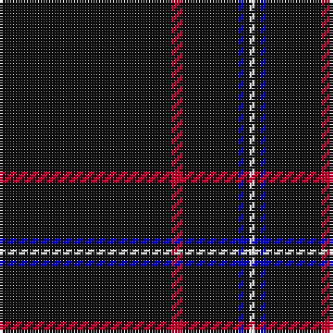

The parent of this is [NewGeneration Alchemy (NGA) Inc](/tartans/k/62/r4/k20/b2/k2/w/2/)

This was sourced from register-of-tartans.  It is a [6 stripes tartan](/stripes/stripes6/).

Original link https://www.tartanregister.gov.uk/tartanDetails.aspx?ref=11058

## Thread count
K/62 R4 K20 B2 K2 W/2

## Palette
Each colour and its ΔE from the base-6 reference it is a variant of.

| Colour | Shade | Base | ΔE (OKLab) |
|---|---|---|---|
| B |  `#0000CD` | B  | 0.15 |
| K |  `#101010` | K  | 0.17 |
| R |  `#C8002C` | R  | 0.03 |
| W |  `#FFFFFF` | W  | 0.03 |

# Sample pattern

ID: /variants/k/62/r4/k20/b2/k2/w/2-b0000cd-k101010-rc8002c-wffffff/
