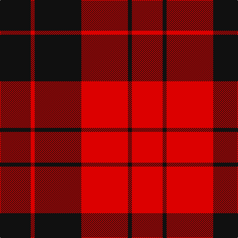

The parent of this is [Erskine (Paton)](/tartans/k/62/r8/k94/r94/k8/r/62/)

This was sourced from register-of-tartans.  It is a [6 stripes tartan](/stripes/stripes6/).

Original link https://www.tartanregister.gov.uk/tartanDetails.aspx?ref=1121

## Thread count
K/62 R8 K94 R94 K8 R/62

## Palette
Each colour and its ΔE from the base-6 reference it is a variant of.

| Colour | Shade | Base | ΔE (OKLab) |
|---|---|---|---|
| K |  `#101010` | K  | 0.17 |
| R |  `#DC0000` | R  | 0.04 |

# Sample pattern

ID: /variants/k/62/r8/k94/r94/k8/r/62-k101010-rdc0000/
