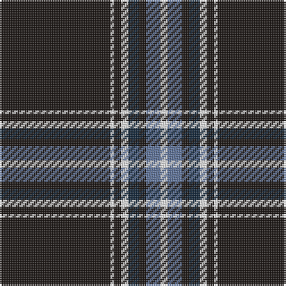

The parent of this is [Capco](/tartans/k/62/w2/k4/w4/dn6/k4/b8/w/4/)

This was sourced from register-of-tartans.  It is a [8 stripes tartan](/stripes/stripes8/).

Original link https://www.tartanregister.gov.uk/tartanDetails.aspx?ref=11380

## Thread count
K/62 W2 K4 W4 DN6 K4 B8 W/4

## Palette
Each colour and its ΔE from the base-6 reference it is a variant of.

| Colour | Shade | Base | ΔE (OKLab) |
|---|---|---|---|
| B |  `#5F749C` | B  | 0.17 |
| DN |  `#14283C` | B  | 0.14 |
| K |  `#1C1714` | K  | 0.21 |
| W |  `#F8F8F8` | W  | 0.01 |

# Sample pattern

ID: /variants/k/62/w2/k4/w4/dn6/k4/b8/w/4-b5f749c-dn14283c-k1c1714-wf8f8f8/
