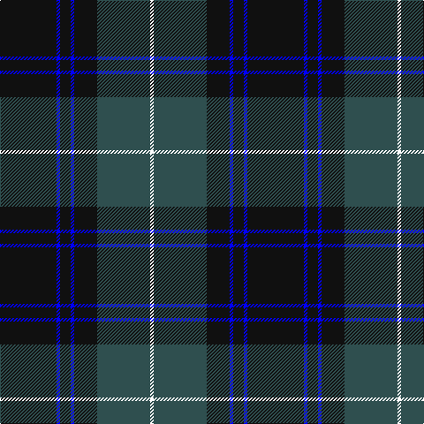

The parent of this is [Mountain Rescue Association Honor Guard](/tartans/k/64/b4/k12/b4/k26/n60/w/4/)

This was sourced from register-of-tartans.  It is a [7 stripes tartan](/stripes/stripes7/).

Original link https://www.tartanregister.gov.uk/tartanDetails.aspx?ref=3031

## Thread count
K/64 B4 K12 B4 K26 N60 W/4

## Palette
Each colour and its ΔE from the base-6 reference it is a variant of.

| Colour | Shade | Base | ΔE (OKLab) |
|---|---|---|---|
| B |  `#0000FF` | B  | 0.21 |
| K |  `#101010` | K  | 0.17 |
| N |  `#2F4F4F` | B  | 0.11 |
| W |  `#FFFFFF` | W  | 0.03 |

# Sample pattern

ID: /variants/k/64/b4/k12/b4/k26/n60/w/4-b0000ff-k101010-n2f4f4f-wffffff/
