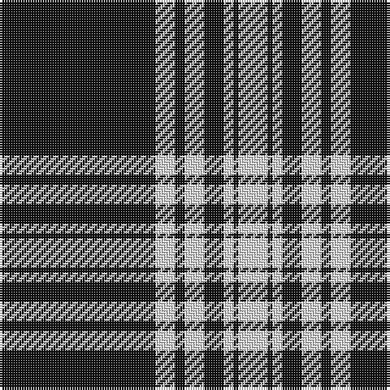

The parent of this is [Menzies B/W Clan Tartan Tartan Number: 1244. Earliest known date: 1934 Not the tartan in Wilsons pattern books See products available Copyright © Blair Urquhart, Comrie, 2015](/tartans/k/64/ln8/k4/ln8/k8/ln4/k2/ln/12/)

This was sourced from house-of-tartan.  It is a [8 stripes tartan](/stripes/stripes8/).

Original link http://www.house-of-tartan.scotland.net/house/TartanViewjs.asp?colr=Def&tnam=1244

## Thread count
K/64 LN8 K4 LN8 K8 LN4 K2 LN/12

## Palette
Each colour and its ΔE from the base-6 reference it is a variant of.

| Colour | Shade | Base | ΔE (OKLab) |
|---|---|---|---|
| K |  `#101010` | K  | 0.17 |
| LN |  `#E0E0E0` | W  | 0.06 |

# Sample pattern

ID: /variants/k/64/ln8/k4/ln8/k8/ln4/k2/ln/12-k101010-lne0e0e0/
