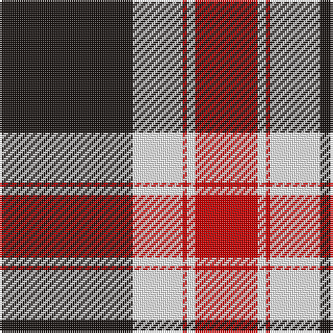

The parent of this is [Nunes (2014)](/tartans/k/64/w24/r2/w4/r/30/)

This was sourced from register-of-tartans.  It is a [5 stripes tartan](/stripes/stripes5/).

Original link https://www.tartanregister.gov.uk/tartanDetails.aspx?ref=10985

## Thread count
K/64 W24 R2 W4 R/30

## Palette
Each colour and its ΔE from the base-6 reference it is a variant of.

| Colour | Shade | Base | ΔE (OKLab) |
|---|---|---|---|
| K |  `#1C1714` | K  | 0.21 |
| R |  `#C80000` | R  | 0.00 |
| W |  `#FFFFFF` | W  | 0.03 |

# Sample pattern

ID: /variants/k/64/w24/r2/w4/r/30-k1c1714-rc80000-wffffff/
