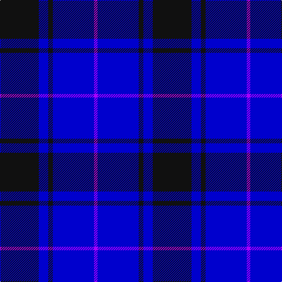

The parent of this is [Fenston/Morris (Personal)](/tartans/k/66/b16/k8/b70/p/6/)

This was sourced from register-of-tartans.  It is a [5 stripes tartan](/stripes/stripes5/).

Original link https://www.tartanregister.gov.uk/tartanDetails.aspx?ref=1158

## Thread count
K/66 B16 K8 B70 P/6

## Palette
Each colour and its ΔE from the base-6 reference it is a variant of.

| Colour | Shade | Base | ΔE (OKLab) |
|---|---|---|---|
| B |  `#0000CD` | B  | 0.15 |
| K |  `#101010` | K  | 0.17 |
| P |  `#AA00FF` | B  | 0.29 |

# Sample pattern

ID: /variants/k/66/b16/k8/b70/p/6-b0000cd-k101010-paa00ff/
