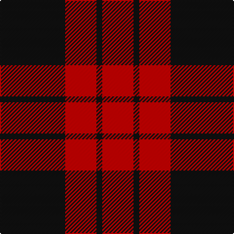

The parent of this is [Lendrum or MacFarlane Clan Tartan Tartan Number: 1190. Earliest known date: (1815-20) MacGregor-Hastie's notes say 'The sett is the same as MacFarlane Black and Red See products available Copyright © Blair Urquhart, Comrie, 2015](/tartans/k/67/r32/k6/r/32/)

This was sourced from house-of-tartan.  It is a [4 stripes tartan](/stripes/stripes4/).

Original link http://www.house-of-tartan.scotland.net/house/TartanViewjs.asp?colr=Def&tnam=1190

## Thread count
K/67 R32 K6 R/32

## Palette
Each colour and its ΔE from the base-6 reference it is a variant of.

| Colour | Shade | Base | ΔE (OKLab) |
|---|---|---|---|
| K |  `#101010` | K  | 0.17 |
| R |  `#C80000` | R  | 0.00 |

# Sample pattern

ID: /variants/k/67/r32/k6/r/32-k101010-rc80000/
