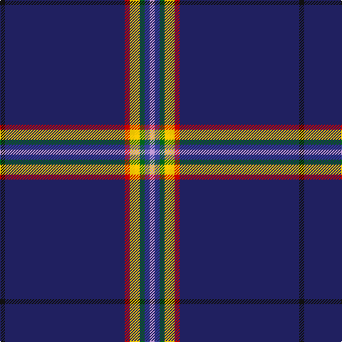

The parent of this is [Way of the Rainbow](/tartans/k/7/db168/r7/ya7/y7/g7/b7/lp/7/)

This was sourced from tartans-authority.  It is a [8 stripes tartan](/stripes/stripes8/).

Original link http://www.tartansauthority.com/tartan-ferret/display/11048/

## Thread count
K/7 DB168 R7 Ya7 Y7 G7 B7 LP/7

## Palette
Each colour and its ΔE from the base-6 reference it is a variant of.

| Colour | Shade | Base | ΔE (OKLab) |
|---|---|---|---|
| B |  `#38409C` | B  | 0.04 |
| DB |  `#202060` | B  | 0.11 |
| G |  `#006818` | G  | 0.02 |
| K |  `#101010` | K  | 0.17 |
| LP |  `#C49CD8` | W  | 0.24 |
| R |  `#C80000` | R  | 0.00 |
| Y |  `#FCCC00` | Y  | 0.04 |
| Ya |  `#E8C000` | Y  | 0.00 |

# Sample pattern

ID: /variants/k/7/db168/r7/ya7/y7/g7/b7/lp/7-b38409c-db202060-g006818-k101010-lpc49cd8-rc80000-yfccc00-yae8c000/
