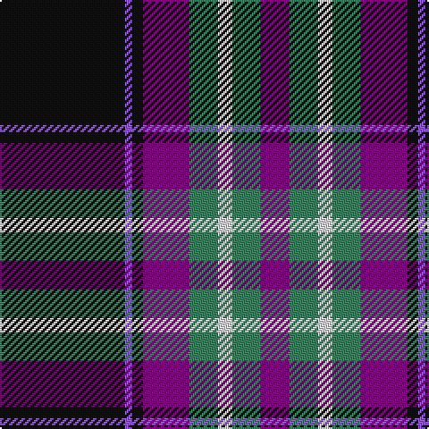

The parent of this is [SheBoom](/tartans/k/70/p4/k6/pa26/g16/ln8/g16/pa/16/)

This was sourced from register-of-tartans.  It is a [8 stripes tartan](/stripes/stripes8/).

Original link https://www.tartanregister.gov.uk/tartanDetails.aspx?ref=11031

## Thread count
K/70 P4 K6 Pa26 G16 LN8 G16 Pa/16

## Palette
Each colour and its ΔE from the base-6 reference it is a variant of.

| Colour | Shade | Base | ΔE (OKLab) |
|---|---|---|---|
| G |  `#408060` | G  | 0.13 |
| K |  `#101010` | K  | 0.17 |
| LN |  `#E0E0E0` | W  | 0.06 |
| P |  `#9058D8` | B  | 0.22 |
| Pa |  `#780078` | B  | 0.16 |

# Sample pattern

ID: /variants/k/70/p4/k6/pa26/g16/ln8/g16/pa/16-g408060-k101010-lne0e0e0-p9058d8-pa780078/
