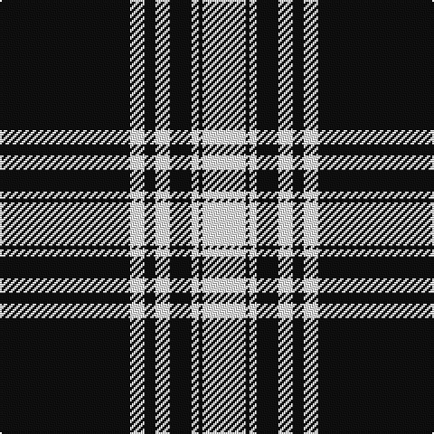

The parent of this is [Menzies 1938 - Mourning (Clan)](/tartans/k/72/w8/k6/w8/k12/w4/k2/w/24/)

This was sourced from tartans-authority.  It is a [8 stripes tartan](/stripes/stripes8/).

Original link http://www.tartansauthority.com/tartan-ferret/display/1244/

## Thread count
K/72 W8 K6 W8 K12 W4 K2 W/24

## Palette
Each colour and its ΔE from the base-6 reference it is a variant of.

| Colour | Shade | Base | ΔE (OKLab) |
|---|---|---|---|
| K |  `#101010` | K  | 0.17 |
| W |  `#FCFCFC` | W  | 0.03 |

# Sample pattern

ID: /variants/k/72/w8/k6/w8/k12/w4/k2/w/24-k101010-wfcfcfc/
