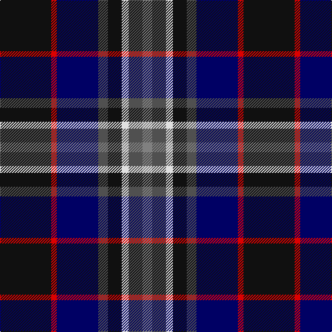

The parent of this is [Yates](/tartans/k/74/r8/db60/n14/k20/ln10/n20/na/14/)

This was sourced from register-of-tartans.  It is a [8 stripes tartan](/stripes/stripes8/).

Original link https://www.tartanregister.gov.uk/tartanDetails.aspx?ref=5950

## Thread count
K/74 R8 DB60 N14 K20 LN10 N20 Na/14

## Palette
Each colour and its ΔE from the base-6 reference it is a variant of.

| Colour | Shade | Base | ΔE (OKLab) |
|---|---|---|---|
| DB |  `#000064` | B  | 0.17 |
| K |  `#101010` | K  | 0.17 |
| LN |  `#E0E0E0` | W  | 0.06 |
| N |  `#505050` | B  | 0.12 |
| Na |  `#808080` | G  | 0.22 |
| R |  `#DC0000` | R  | 0.04 |

# Sample pattern

ID: /variants/k/74/r8/db60/n14/k20/ln10/n20/na/14-db000064-k101010-lne0e0e0-n505050-na808080-rdc0000/
