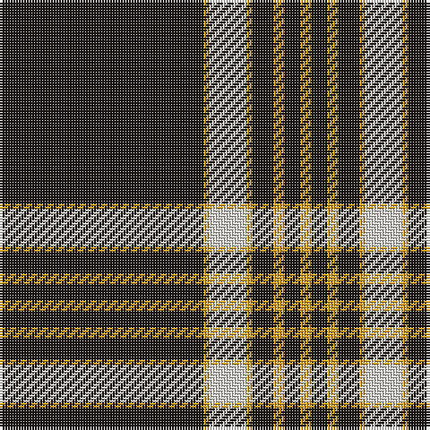

The parent of this is [Erck, Georges van (Personal),](/tartans/k/76/y2/w14/y2/k8/y4/k6/y/4/)

This was sourced from register-of-tartans.  It is a [8 stripes tartan](/stripes/stripes8/).

Original link https://www.tartanregister.gov.uk/tartanDetails.aspx?ref=10838

## Thread count
K/76 Y2 W14 Y2 K8 Y4 K6 Y/4

## Palette
Each colour and its ΔE from the base-6 reference it is a variant of.

| Colour | Shade | Base | ΔE (OKLab) |
|---|---|---|---|
| K |  `#1C1714` | K  | 0.21 |
| W |  `#E5E0D2` | W  | 0.06 |
| Y |  `#E0A126` | Y  | 0.08 |

# Sample pattern

ID: /variants/k/76/y2/w14/y2/k8/y4/k6/y/4-k1c1714-we5e0d2-ye0a126/
