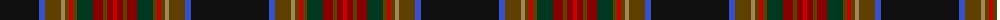

The parent of this is [GRM (Fashion)](/tartans/k/78/b6/t16/lt4/t4/r4/t4/dg16/dr10/t4/dr6/r/4/)

This was sourced from tartans-authority.  It is a [12 stripes tartan](/stripes/stripes12/).

Original link http://www.tartansauthority.com/tartan-ferret/display/4080/

## Thread count
K/78 B6 T16 LT4 T4 R4 T4 DG16 DR10 T4 DR6 R/4

## Palette
Each colour and its ΔE from the base-6 reference it is a variant of.

| Colour | Shade | Base | ΔE (OKLab) |
|---|---|---|---|
| B |  `#3850C8` | B  | 0.12 |
| DG |  `#003820` | G  | 0.16 |
| DR |  `#880000` | R  | 0.14 |
| K |  `#101010` | K  | 0.17 |
| LT |  `#A08858` | Y  | 0.21 |
| R |  `#C80000` | R  | 0.00 |
| T |  `#604000` | G  | 0.14 |

ID: /variants/k/78/b6/t16/lt4/t4/r4/t4/dg16/dr10/t4/dr6/r/4-b3850c8-dg003820-dr880000-k101010-lta08858-rc80000-t604000/
