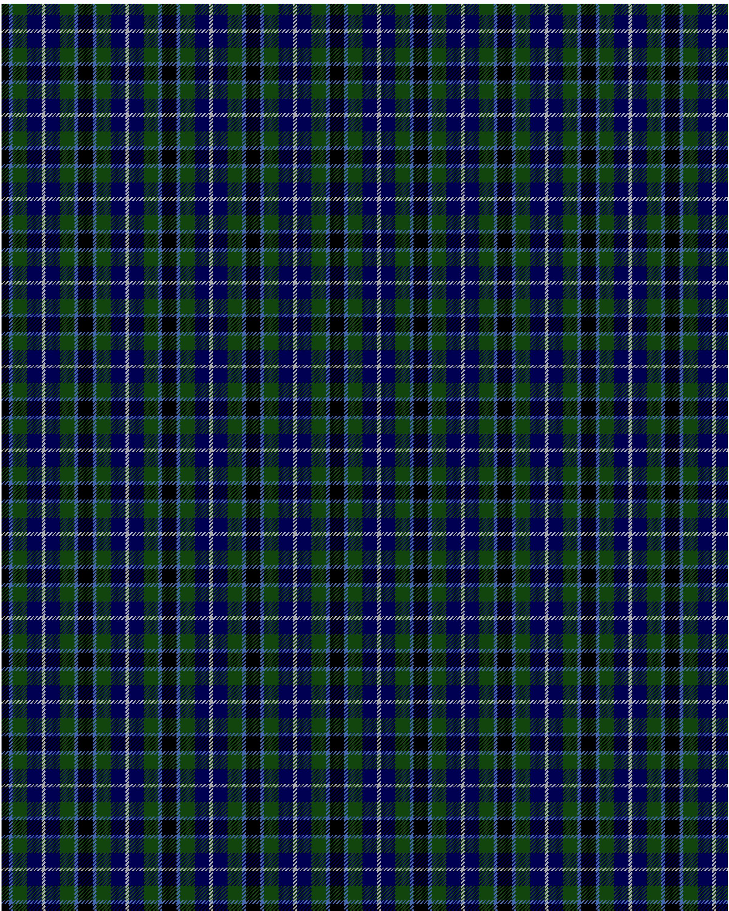

The parent of this is [Dougles Green](/tartans/k/8/b4/dg16/db16/n/2/)

This was sourced from <no value>.  It is a [5 stripes tartan](/stripes/stripes5/).

Original link http://www.weddslist.com/cgi-bin/tartans/pg.pl?source=tinsel

## Thread count
K/8 B4 DG16 DB16 N/2

## Palette
B DB DG K N

# Sample pattern

ID: /variants/k/8/b4/dg16/db16/n/2-b4367ae-db000052-dg11450d-k000000-naaaaaa/