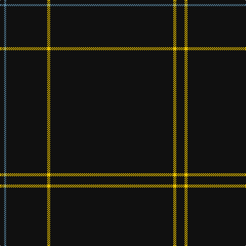

The parent of this is [Lochaber (Hesketh)](/tartans/k/8/b4/k80/y6/k240/y6/k/16/)

This was sourced from register-of-tartans.  It is a [7 stripes tartan](/stripes/stripes7/).

Original link https://www.tartanregister.gov.uk/tartanDetails.aspx?ref=2162

## Thread count
K/8 B4 K80 Y6 K240 Y6 K/16

## Palette
Each colour and its ΔE from the base-6 reference it is a variant of.

| Colour | Shade | Base | ΔE (OKLab) |
|---|---|---|---|
| B |  `#5C8CA8` | B  | 0.23 |
| K |  `#101010` | K  | 0.17 |
| Y |  `#E8C000` | Y  | 0.00 |

# Sample pattern

ID: /variants/k/8/b4/k80/y6/k240/y6/k/16-b5c8ca8-k101010-ye8c000/
