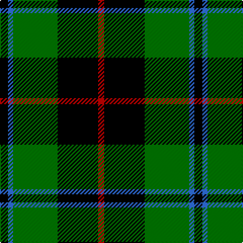

The parent of this is [Douglas, Black (Clan?)](/tartans/k/8/b5/g44/k40/r/6/)

This was sourced from tartans-authority.  It is a [5 stripes tartan](/stripes/stripes5/).

Original link http://www.tartansauthority.com/tartan-ferret/display/1029/

## Thread count
K/8 B5 G44 K40 R/6

## Palette
Each colour and its ΔE from the base-6 reference it is a variant of.

| Colour | Shade | Base | ΔE (OKLab) |
|---|---|---|---|
| B |  `#3070FC` | B  | 0.22 |
| G |  `#007800` | G  | 0.06 |
| K |  `#000000` | K  | 0.00 |
| R |  `#C40000` | R  | 0.01 |

# Sample pattern

ID: /variants/k/8/b5/g44/k40/r/6-b3070fc-g007800-k000000-rc40000/
