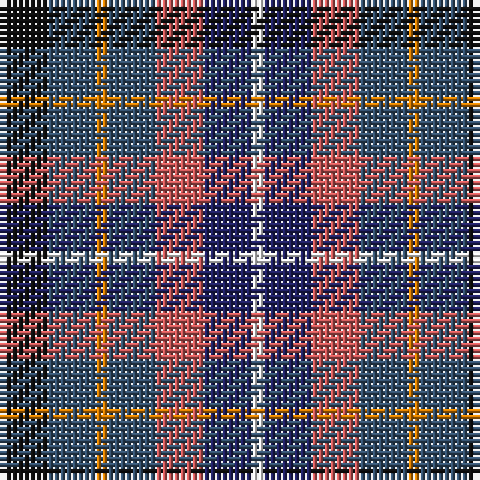

The parent of this is [Blackdown Hills Corporate Tartan Tartan Number: 6711. Earliest known date: 1991 The Blackdown Hills on the Devon/Somerset border were designated as an Area of Outstanding Natural Beauty (AONB) in 1991 and this tartan was designed to celebrate that occasion. Designed at Coldharbour Mill at Cullompton in Devon. See products available Copyright © Blair Urquhart, Comrie, 2015](/tartans/k/8/b8/o2/b8/do8/db8/w/2/)

This was sourced from house-of-tartan.  It is a [7 stripes tartan](/stripes/stripes7/).

Original link http://www.house-of-tartan.scotland.net/house/TartanViewjs.asp?colr=Def&tnam=6711

## Thread count
K/8 B8 O2 B8 DO8 DB8 W/2

## Palette
Each colour and its ΔE from the base-6 reference it is a variant of.

| Colour | Shade | Base | ΔE (OKLab) |
|---|---|---|---|
| B |  `#34506C` | B  | 0.07 |
| DB |  `#202060` | B  | 0.11 |
| DO |  `#C85858` | R  | 0.11 |
| K |  `#101010` | K  | 0.17 |
| N |  `#406054` | G  | 0.11 |
| O |  `#D87C00` | Y  | 0.17 |
| R |  `#C80000` | R  | 0.00 |
| W |  `#F8F8F8` | W  | 0.01 |

# Sample pattern

ID: /variants/k/8/b8/o2/b8/do8/db8/w/2-b34506c-db202060-doc85858-k101010-n406054-od87c00-rc80000-wf8f8f8/
