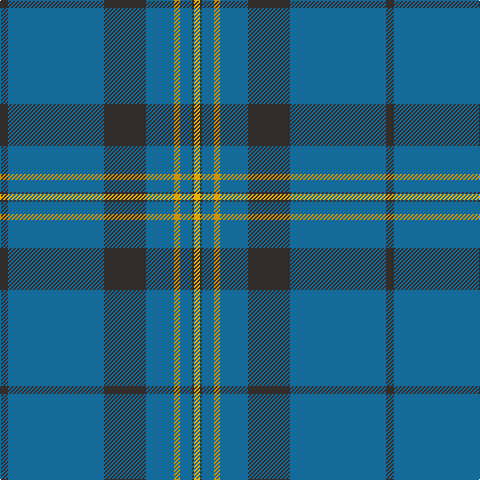

The parent of this is [Munster Ancestry](/tartans/k/8/b96/k42/b28/dy6/b12/k2/y/6/)

This was sourced from register-of-tartans.  It is a [8 stripes tartan](/stripes/stripes8/).

Original link https://www.tartanregister.gov.uk/tartanDetails.aspx?ref=10799

## Thread count
K/8 B96 K42 B28 DY6 B12 K2 Y/6

## Palette
Each colour and its ΔE from the base-6 reference it is a variant of.

| Colour | Shade | Base | ΔE (OKLab) |
|---|---|---|---|
| B |  `#146A99` | B  | 0.12 |
| DY |  `#C4950C` | Y  | 0.13 |
| K |  `#332C2C` | B  | 0.15 |
| Y |  `#E7B205` | Y  | 0.04 |

# Sample pattern

ID: /variants/k/8/b96/k42/b28/dy6/b12/k2/y/6-b146a99-dyc4950c-k332c2c-ye7b205/
