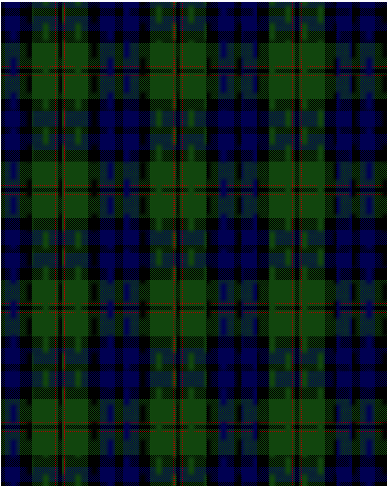

The parent of this is [Dundas](/tartans/k/8/db32/k24/dg48/dr2/dg4/k/4/)

This was sourced from <no value>.  It is a [7 stripes tartan](/stripes/stripes7/).

Original link http://www.weddslist.com/cgi-bin/tartans/pg.pl?source=tinsel

## Thread count
K/8 DB32 K24 DG48 DR2 DG4 K/4

## Palette
DB DG DR K

# Sample pattern

ID: /variants/k/8/db32/k24/dg48/dr2/dg4/k/4-db000052-dg11450d-draa0000-k000000/