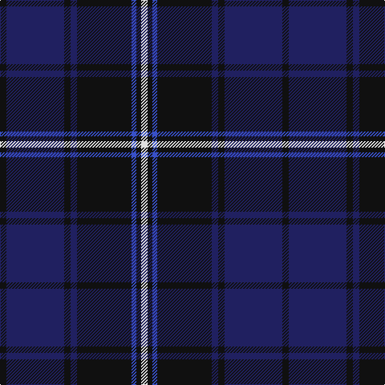

The parent of this is [Slanj Dress (Corporate)](/tartans/k/8/db72/k8/db8/k68/b6/k6/ln/8/)

This was sourced from tartans-authority.  It is a [8 stripes tartan](/stripes/stripes8/).

Original link http://www.tartansauthority.com/tartan-ferret/display/6426/

## Thread count
K/8 DB72 K8 DB8 K68 B6 K6 LN/8

## Palette
Each colour and its ΔE from the base-6 reference it is a variant of.

| Colour | Shade | Base | ΔE (OKLab) |
|---|---|---|---|
| B |  `#3850C8` | B  | 0.12 |
| DB |  `#202060` | B  | 0.11 |
| K |  `#101010` | K  | 0.17 |
| LN |  `#E0E0E0` | W  | 0.06 |

# Sample pattern

ID: /variants/k/8/db72/k8/db8/k68/b6/k6/ln/8-b3850c8-db202060-k101010-lne0e0e0/
