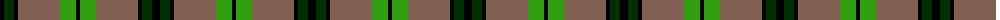

The parent of this is [MacDuck](/tartans/k/8/dg10/k4/lt42/g16/k/4/)

This was sourced from weddslist.  It is a [6 stripes tartan](/stripes/stripes6/).

Original link http://www.weddslist.com/cgi-bin/tartans/pg.pl?source=sts

## Thread count
K/8 DG10 K4 LT42 G16 K/4

## Palette
Each colour and its ΔE from the base-6 reference it is a variant of.

| Colour | Shade | Base | ΔE (OKLab) |
|---|---|---|---|
| DG |  `#003000` | G  | 0.18 |
| G |  `#30A010` | G  | 0.19 |
| K |  `#000000` | K  | 0.00 |
| LT |  `#806050` | R  | 0.17 |

# Sample pattern

ID: /variants/k/8/dg10/k4/lt42/g16/k/4-dg003000-g30a010-k000000-lt806050/
