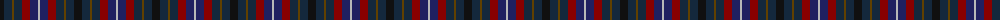
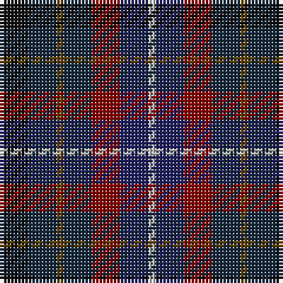

The parent of this is [Blackdown Hills (Corporate)](/tartans/k/8/dn8/t2/dn8/dr8/db8/n/2/)

This was sourced from tartans-authority.  It is a [7 stripes tartan](/stripes/stripes7/).

Original link http://www.tartansauthority.com/tartan-ferret/display/6711/

## Thread count
K/8 DN8 T2 DN8 DR8 DB8 N/2

## Palette
Each colour and its ΔE from the base-6 reference it is a variant of.

| Colour | Shade | Base | ΔE (OKLab) |
|---|---|---|---|
| DB |  `#202060` | B  | 0.11 |
| DN |  `#14283C` | B  | 0.14 |
| DR |  `#880000` | R  | 0.14 |
| K |  `#101010` | K  | 0.17 |
| N |  `#B8B8B8` | Y  | 0.17 |
| T |  `#604000` | G  | 0.14 |

# Sample pattern

ID: /variants/k/8/dn8/t2/dn8/dr8/db8/n/2-db202060-dn14283c-dr880000-k101010-nb8b8b8-t604000/
