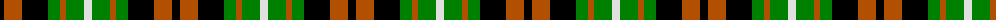

The parent of this is [Ramsay, Red](/tartans/k/8/do18/k26/g12/do6/g18/ln/8/)

This was sourced from weddslist.  It is a [7 stripes tartan](/stripes/stripes7/).

Original link http://www.weddslist.com/cgi-bin/tartans/pg.pl?source=sts

## Thread count
K/8 DO18 K26 G12 DO6 G18 LN/8

## Palette
Each colour and its ΔE from the base-6 reference it is a variant of.

| Colour | Shade | Base | ΔE (OKLab) |
|---|---|---|---|
| DO |  `#B05000` | R  | 0.10 |
| G |  `#008000` | G  | 0.09 |
| K |  `#000000` | K  | 0.00 |
| LN |  `#E0E0E0` | W  | 0.06 |

# Sample pattern

ID: /variants/k/8/do18/k26/g12/do6/g18/ln/8-dob05000-g008000-k000000-lne0e0e0/
