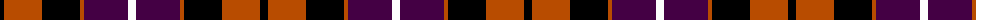
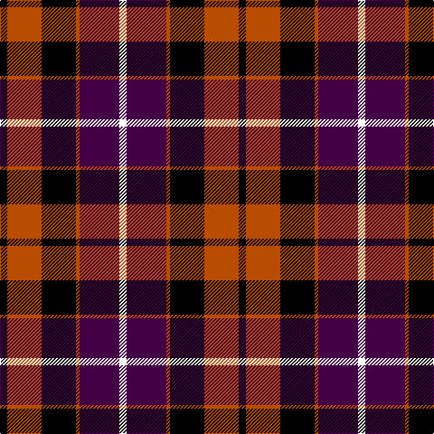

The parent of this is [Dutch (District)](/tartans/k/8/do38/k38/do4/dp44/w/8/)

This was sourced from tartans-authority.  It is a [6 stripes tartan](/stripes/stripes6/).

Original link http://www.tartansauthority.com/tartan-ferret/display/1134/

## Thread count
K/8 DO38 K38 DO4 DP44 W/8

## Palette
Each colour and its ΔE from the base-6 reference it is a variant of.

| Colour | Shade | Base | ΔE (OKLab) |
|---|---|---|---|
| DO |  `#B84C00` | R  | 0.08 |
| DP |  `#440044` | B  | 0.17 |
| K |  `#000000` | K  | 0.00 |
| W |  `#FCFCFC` | W  | 0.03 |

# Sample pattern

ID: /variants/k/8/do38/k38/do4/dp44/w/8-dob84c00-dp440044-k000000-wfcfcfc/
