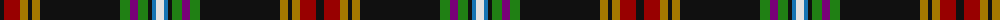

The parent of this is [MacMunn](/tartans/k/8/dr16/dy8/k4/dy8/k80/g10/p8/g10/k4/b4/ln/8/)

This was sourced from tartans-authority.  It is a [12 stripes tartan](/stripes/stripes12/).

Original link http://www.tartansauthority.com/tartan-ferret/display/7272/

## Thread count
K/8 DR16 DY8 K4 DY8 K80 G10 P8 G10 K4 B4 LN/8

## Palette
Each colour and its ΔE from the base-6 reference it is a variant of.

| Colour | Shade | Base | ΔE (OKLab) |
|---|---|---|---|
| B |  `#1474B4` | B  | 0.15 |
| DR |  `#980000` | R  | 0.10 |
| DY |  `#A47800` | R  | 0.19 |
| G |  `#208014` | G  | 0.09 |
| K |  `#101010` | K  | 0.17 |
| LN |  `#E0E0E0` | W  | 0.06 |
| P |  `#780078` | B  | 0.16 |

ID: /variants/k/8/dr16/dy8/k4/dy8/k80/g10/p8/g10/k4/b4/ln/8-b1474b4-dr980000-dya47800-g208014-k101010-lne0e0e0-p780078/
