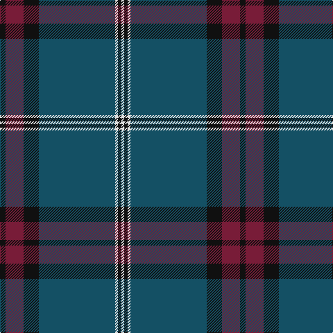

The parent of this is [Edinburgh, The University of](/tartans/k/8/dr26/k22/db110/ln4/k5/ln/4/)

This was sourced from register-of-tartans.  It is a [7 stripes tartan](/stripes/stripes7/).

Original link https://www.tartanregister.gov.uk/tartanDetails.aspx?ref=5907

## Thread count
K/8 DR26 K22 DB110 LN4 K5 LN/4

## Palette
Each colour and its ΔE from the base-6 reference it is a variant of.

| Colour | Shade | Base | ΔE (OKLab) |
|---|---|---|---|
| DB |  `#145064` | B  | 0.08 |
| DR |  `#781C38` | R  | 0.17 |
| K |  `#101010` | K  | 0.17 |
| LN |  `#E0E0E0` | W  | 0.06 |

# Sample pattern

ID: /variants/k/8/dr26/k22/db110/ln4/k5/ln/4-db145064-dr781c38-k101010-lne0e0e0/
