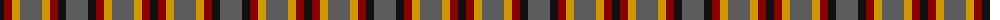
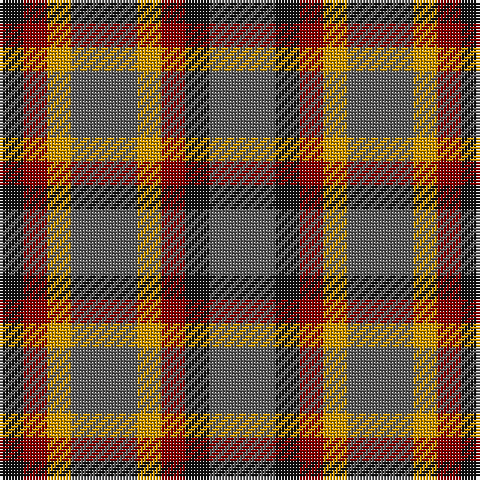

The parent of this is [Ikelman #3 (Personal)](/tartans/k/8/dr8/dy8/n22/dy8/dr8/k8/n/22/)

This was sourced from register-of-tartans.  It is a [8 stripes tartan](/stripes/stripes8/).

Original link https://www.tartanregister.gov.uk/tartanDetails.aspx?ref=1813

## Thread count
K/8 DR8 DY8 N22 DY8 DR8 K8 N/22

## Palette
Each colour and its ΔE from the base-6 reference it is a variant of.

| Colour | Shade | Base | ΔE (OKLab) |
|---|---|---|---|
| DR |  `#880000` | R  | 0.14 |
| DY |  `#D09800` | Y  | 0.11 |
| K |  `#101010` | K  | 0.17 |
| N |  `#5C5C5C` | B  | 0.14 |

# Sample pattern

ID: /variants/k/8/dr8/dy8/n22/dy8/dr8/k8/n/22-dr880000-dyd09800-k101010-n5c5c5c/
