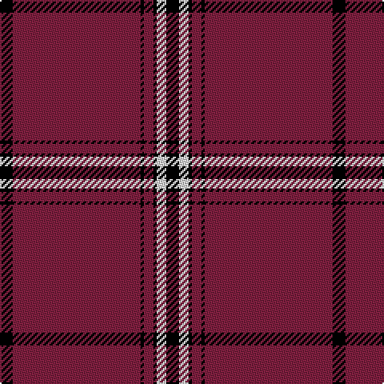

The parent of this is [Salt Lake County](/tartans/k/8/dr80/k2/dr6/k2/ln6/k/8/)

This was sourced from weddslist.  It is a [7 stripes tartan](/stripes/stripes7/).

Original link http://www.weddslist.com/cgi-bin/tartans/pg.pl?source=sts

## Thread count
K/8 DR80 K2 DR6 K2 LN6 K/8

## Palette
Each colour and its ΔE from the base-6 reference it is a variant of.

| Colour | Shade | Base | ΔE (OKLab) |
|---|---|---|---|
| DR |  `#802040` | R  | 0.16 |
| K |  `#000000` | K  | 0.00 |
| LN |  `#E0E0E0` | W  | 0.06 |

# Sample pattern

ID: /variants/k/8/dr80/k2/dr6/k2/ln6/k/8-dr802040-k000000-lne0e0e0/
